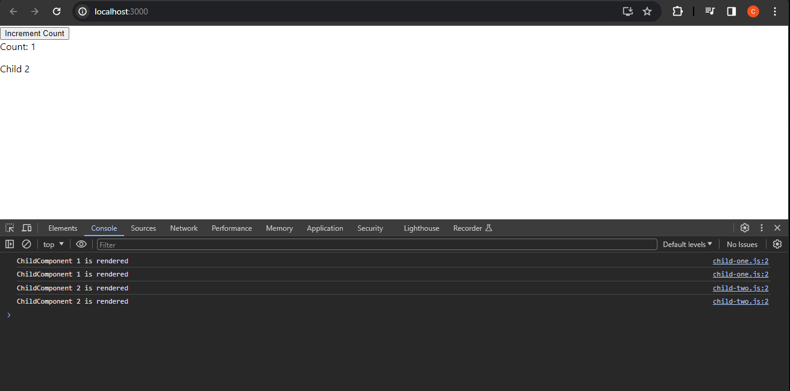

# Why Preact Signals Better than React Hooks for Me

As a React developer for 5 years, I have challenges managing state. React hooks improved the situation, but dealing with nested hooks, manual caching, and complex logic was still a struggle. Then came `@preact/signals-react`, a little-known library that turned my development chaos into a more peaceful and organized experience.

Getting stuck in the world of React hooks had its exciting beginning. The idea of managing the state functionally brought a sense of accomplishment. However, as projects expanded, so did the complications with hooks. Dealing with nested useEffect hooks felt like navigating through dense jungles, conditional rendering logic turned messy, and the constant threat of re-renders impacted performance and sanity.

I discovered `@preact/signals-react`, and at first, it appeared almost too good to be true. “Managing state without hooks? Can that really work?” However, as I explored further, a feeling of relief came over me. It wasn’t some magic trick; it was a whole new way of doing things, centered around reactive data streams known as `@preact/signals-react`.

---

### Here’s what blew me away:

**Performance optimization**: `@preact/signals-react` helps reduce unnecessary re-renders of components, which leads to faster app loading, smoother interactions, and better overall.

**Simplified State Management**: In small to large-sized apps, `@preact/signals-react` can often replace more complex state management libraries, making your code easier to understand and maintain.

**Improve code organization**: `@preact/signals-react` keeps track of data changes clearly and predictably, making our code more organized and less prone to error.

---

### When we use React Hooks:

When we look at the console, we see that both Child-One and Child-Two components re-render every time we click the ‘Increment Count’ button. Based on the logic, the re-rendering of Child-Two each time is unnecessary.

---

### Useful Links:

[Read more about Signal](https://medium.com/@cdileep40/why-preact-signals-better-than-react-hooks-for-me-151de79c2eeb)

[Preact/Signal official webpage](https://preactjs.com/)

Happy coding :)
